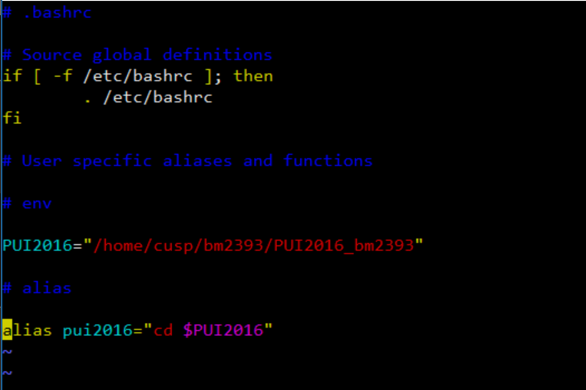
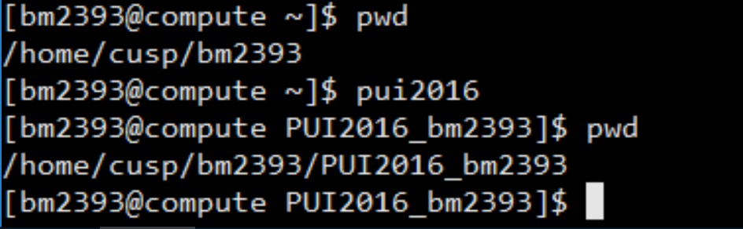

# PUI 2016 HW1

In this homework I had to set up my environment to run in a way consistent with the rest of the class. This allows for maximum reproducibility and collaboration!

I set up my .bashrc file:

I tested it to make sure that it worked:

